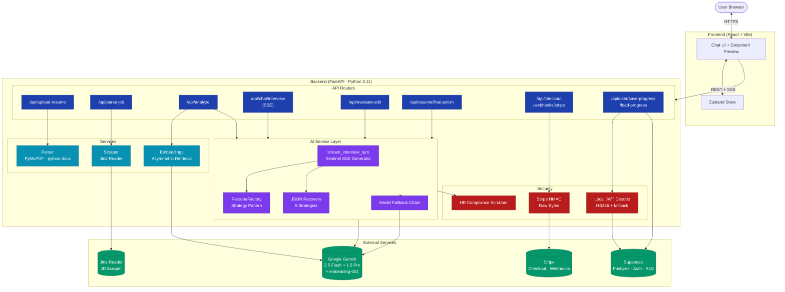
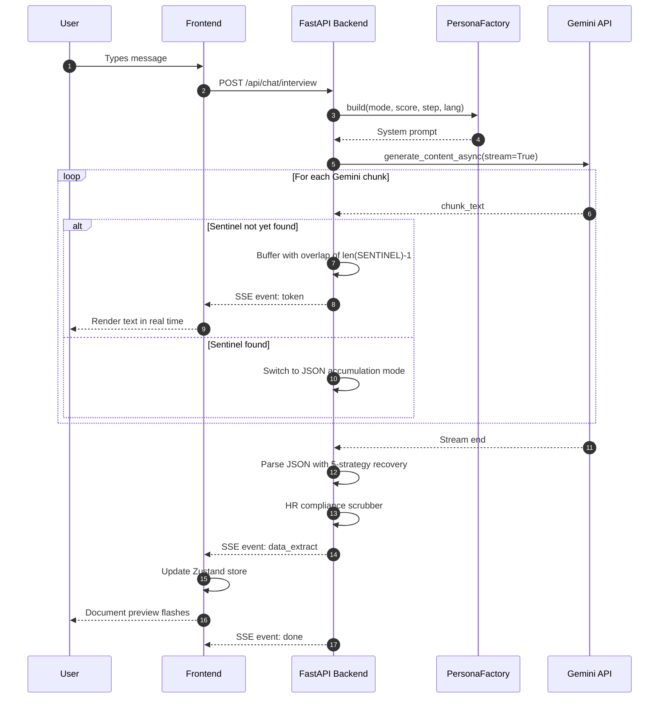
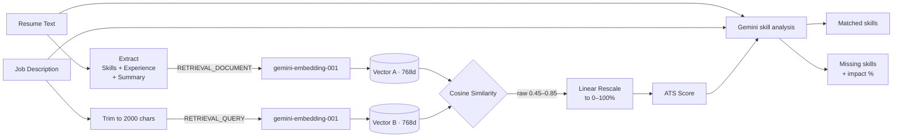
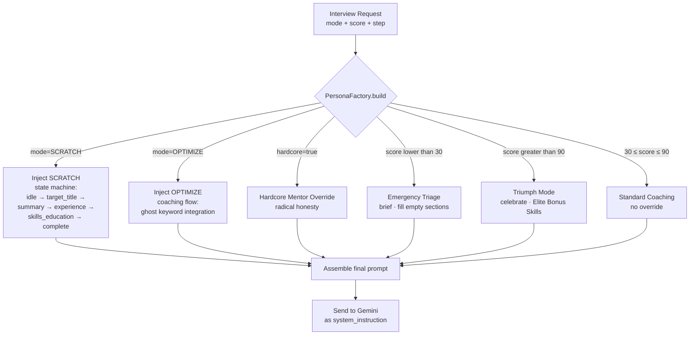

# Jobif — AI Career Co-pilot

An AI-powered resume optimisation engine. Users upload their resume + a target job description, and a multi-agent system streams a real-time interview that rewrites their resume to pass ATS filters and impress Canadian recruiters.

**Stack:** FastAPI · Python 3.11 · Google Gemini 2.5 Flash · Supabase (Postgres + Auth + RLS) · Stripe · Docker · React (frontend, separate repo)

**Live:** _add deployment URL_
**Frontend:** _link if separate repo_

---

## What it does

- **Upload a resume** (PDF / DOCX / TXT) and paste a job posting URL or text.
- **Get an ATS match score** (0–100) with a list of found keywords, missing keywords, and contextual synonym matches (e.g. "Node" ↔ "Node.js").
- **Conversational rewrite** — Mac, an AI Career Co-pilot, asks targeted questions and rewrites bullets in real time using ATS-optimised action verbs.
- **Final Polish** — one-pass HR-Director rewrite of the entire resume with quantification placeholders and Canadian HR compliance.
- **Stripe billing** — $4.99 / 24-hour pass and $14.99 / month subscriptions with HMAC-verified webhooks.

---

# Jobif — Architecture

## System overview



## Interview turn flow — sentinel-delimited streaming



## ATS scoring pipeline



## Persona selection — Strategy pattern


---

## Run locally

### Prerequisites
- Python 3.11
- A Google AI Studio API key
- A Supabase project (URL + service-role key + JWT secret)
- A Stripe test account (optional — billing endpoints degrade gracefully)

### Setup

```bashgit clone https://github.com/Rork96/JobifAI
cd JobifAIpython -m venv .venv
source .venv/bin/activate
pip install -r backend/requirements.txtcp .env.example .env   # fill in the keys
uvicorn backend.main:app --reload
→ http://localhost:8000/docs

### Required environment variables

```envENVIRONMENT=dev
SUPABASE_URL=https://<ref>.supabase.co
SUPABASE_KEY=eyJ...                # service role key
SUPABASE_JWT_SECRET=...            # for local HS256 validation
GEMINI_API_KEY=AIza...
STRIPE_SECRET_KEY=sk_test_...      # optional
STRIPE_WEBHOOK_SECRET=whsec_...    # optional
STRIPE_PRICE_PASS_ID=price_...     # optional
STRIPE_PRICE_MONTHLY_ID=price_...  # optional

### Database

Run `supabase/migrations/20240322000000_user_data.sql` in your Supabase SQL editor. The migration is idempotent.

### Docker (Raspberry Pi 5 deployment)

```bashdocker buildx build --platform linux/arm64 -t jobifai-backend ./backend
docker run -p 8000:8000 --env-file .env jobifai-backend

The Dockerfile is multi-stage (~200 MB final image), runs as a non-root `jobifai` user, and exposes a `/health` endpoint that the included `HEALTHCHECK` instruction polls every 30 seconds.

---

## API reference

OpenAPI docs are auto-generated and available at `/docs` in development. Key endpoints:

| Method | Path | Purpose |
|---|---|---|
| `POST` | `/api/upload-resume` | Parse a PDF / DOCX / TXT resume to plain text |
| `POST` | `/api/parse-job` | Scrape a JD URL via Jina Reader, or normalise pasted text |
| `POST` | `/api/analyze` | One-shot: score + found / missing keywords + Mac's first message |
| `POST` | `/api/chat/interview` | SSE-streamed interview turn (token / data_extract / done events) |
| `POST` | `/api/evaluate-edit` | Quality gate before committing a proposed edit |
| `POST` | `/api/rewrite-section` | "Magic" rewrite of one bullet into a structured diff |
| `POST` | `/api/resume/final-polish` | One-pass HR-Director rewrite of the full resume |
| `POST` | `/api/checkout` | Create a Stripe Checkout Session |
| `POST` | `/api/webhooks/stripe` | HMAC-verified Stripe event receiver |
| `POST` | `/api/user/save-progress` | Debounced auto-save of full session state |
| `GET`  | `/api/user/load-progress` | Hydrate Zustand store on page refresh |

---

## Roadmap

- Cover-letter generator using the same PersonaFactory pattern
- Voice interview mode (Whisper STT → Mac → ElevenLabs TTS)
- Multi-resume management UI (one user, many resumes per JD)
- Postgres `pgvector` migration to colocate embeddings with resume rows

---

## License

MIT
